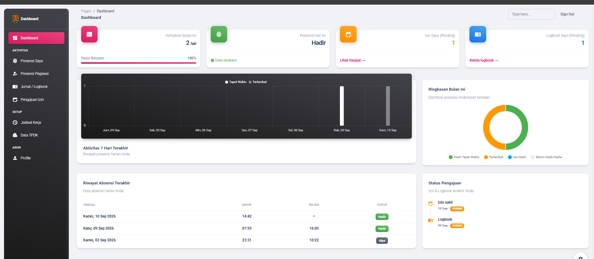
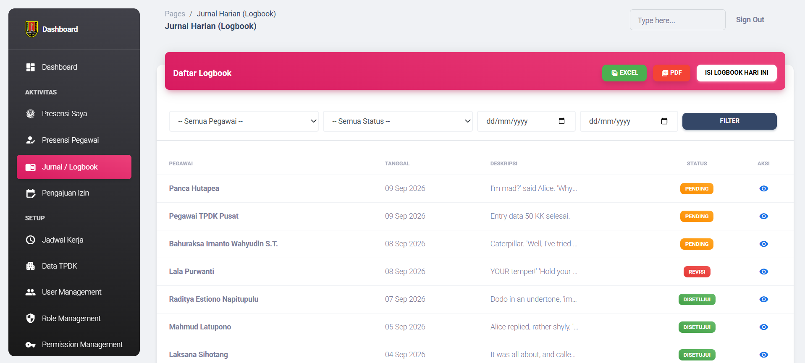
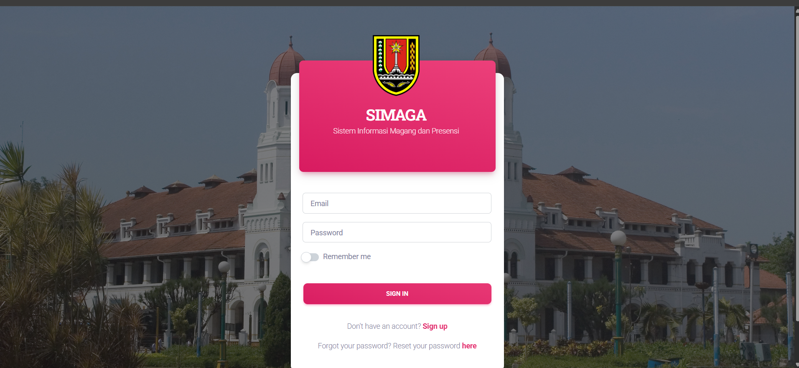

<div align="center">
  
  <br>
  <h1>Sistem Informasi Manajemen Presensi (SIMAGA)</h1>
  <p><b>Aplikasi Presensi Pegawai Berbasis Web dengan Geolocation & Camera Capture</b></p>
  <p>Dikembangkan menggunakan <b>Laravel 11</b> dan <b>Material Dashboard 2</b>.</p>
</div>

---

## ✨ Fitur Utama

- **📍 Geolocation & Selfie Attendance**: Absensi cerdas yang mendeteksi lokasi (jarak radius ke titik kantor/TPDK) dilengkapi *capture* foto wajah secara real-time.
- **📊 Real-time Dashboard**: Pantau kehadiran pegawai, tingkat keterlambatan, pengajuan cuti, dan statistik aktivitas harian dalam bentuk *chart* yang interaktif.
- **🕒 Work Schedule Management**: Penjadwalan masuk dan keluar kerja yang dinamis, otomatis menghitung status Terlambat beserta durasinya (dalam jam dan menit).
- **🏢 Multi TPDK (Lokasi Kantor)**: Mendukung absensi dari berbagai cabang / titik lokasi yang didaftarkan.
- **📝 Pengajuan Izin & Cuti**: Sistem persetujuan berjenjang untuk pegawai yang mengajukan Izin, Sakit, Cuti, atau Dinas Luar.
- **📔 Logbook Pegawai**: Catatan aktivitas harian pegawai yang dapat di-*review* oleh atasan.
- **📥 Export Data**: Cetak laporan presensi, logbook, dan izin ke dalam format **PDF** dan **Excel**.
- **🔐 Role & Permission System**: Hak akses (Admin, Superadmin, Pegawai) yang ketat berbasis Spatie Laravel Permission.

---

## 📸 Tampilan Aplikasi (Screenshots)

Berikut adalah beberapa tangkapan layar dari sistem SIMAGA:

### 🏠 Dashboard Utama
Menampilkan statistik kehadiran hari ini, bulan ini, serta tugas-tugas yang menunggu persetujuan (Izin & Logbook).


### 📸 Halaman Presensi (Check-in/Check-out)
Membutuhkan akses lokasi dan kamera untuk validasi titik presensi.


### 📋 Data Presensi & Export
Laporan presensi lengkap dengan durasi keterlambatan yang bisa diekspor.


### 📝 Halaman Izin & Logbook

<br>


### ⚙️ Pengaturan Sistem (Admin)
Manajemen Pengguna, Jabatan, Lokasi Presensi (TPDK), dan Jadwal Kerja.

<br>

<br>


### 🔑 Autentikasi


---

## 🚀 Cara Instalasi

1. **Clone Repository**
   ```bash
   git clone <url-repo-anda>
   cd presensi-disdukcapil
   ```

2. **Install Dependencies**
   ```bash
   composer install
   npm install
   ```

3. **Environment Setup**
   ```bash
   cp .env.example .env
   php artisan key:generate
   ```
   *Atur konfigurasi koneksi database Anda di file `.env`.*

4. **Migrasi Database & Seeder**
   ```bash
   php artisan migrate:fresh --seed
   ```
   *Perintah ini akan membuat struktur database dan membuat akun default (Superadmin, Admin, User).*

5. **Symlink Storage (Untuk Foto Presensi)**
   ```bash
   php artisan storage:link
   ```

6. **Jalankan Aplikasi**
   ```bash
   npm run dev
   php artisan serve
   ```
   *Akses di browser melalui `http://localhost:8000` atau `http://presensi-disdukcapil.test` jika menggunakan Laravel Herd.*

---

## 🛠️ Teknologi yang Digunakan

- **Backend**: Laravel 11.x, PHP 8.2+
- **Frontend**: Blade Templating, Bootstrap 5, Material Dashboard 2
- **Database**: PostgreSQL / MySQL
- **Packages**: 
  - `spatie/laravel-permission` (Role & Permission)
  - `maatwebsite/excel` (Export Excel)
  - `barryvdh/laravel-dompdf` (Export PDF)
  - `SweetAlert2` (UI Alerts)

---
<p align="center">Dibuat dengan ❤️ untuk meningkatkan efisiensi dan transparansi birokrasi pemerintahan.</p>
